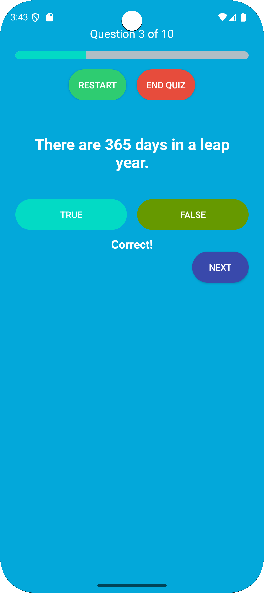

# Quizoku app

# 📱 Quizoku – Android Quiz App

A modern, interactive, and user-friendly Android application developed as part of the **COSC 6362 Mobile Application Development** course homework.
Quizoku challenges users with multiple quiz modes, score tracking, and sound feedback to enhance learning.

---

## 🧩 Features

- ✅ **Two Quiz Modes**
  - **True / False** quiz (General Knowledge – 50 questions pool)
  - **Multiple Choice** quiz (Sports – 50 questions pool)
- 🔀 **10 random questions** each time for a fresh experience
- 🔊 **Optional sound feedback** for correct/wrong answers
- 🎯 **Scoring System**  
  - True/False: +10 per correct answer  
  - Multiple Choice: Tiered scoring based on attempt  
- 🌗 **Settings Screen**
  - Toggle sound
  - Toggle instruction screen
- 💬 **Instruction Screen**
  - Shows how to play each quiz mode
  - "Don't remind me again" checkbox saved with `SharedPreferences`
- 📊 **Result Dialog**
  - Displays total score with rating bar
  - Options to retry, return to home, or exit


## 📸 Screenshots

 
 
 


## 🛠️ Technologies Used

| Tech                | Details                                 |
|---------------------|------------------------------------------|
| Java                | Primary development language             |
| Android SDK         | Android 10+ (API 29+)                    |
| XML Layout          | For UI design                            |
| SharedPreferences   | To store user settings                   |
| SoundPool           | For low-latency audio feedback           |

---

## 📂 Folder Structure

```
├── app/
│   ├── src/
│   │   ├── java/com/pranav/quizoku/
│   │   │   ├── MainActivity.java
│   │   │   ├── TrueFalseQuizActivity.java
│   │   │   ├── MultiChoiceQuizActivity.java
│   │   │   ├── SettingsActivity.java
│   │   │   ├── QuestionTF.java
│   │   │   ├── GKQuestionBank.java
│   │   │   ├── QuestionMCQ.java
│   │   │   ├── SportsQuestionBank.java
│   │   │   └── MultiChoiceQuizInstructionsActivity.java
│   │   └── res/
│   │       ├── layout/  → XML UI files
│   │       ├── drawable/ → Button shapes and icons
│   │       ├── values/  → colors.xml, strings.xml, styles.xml
│   │       └── raw/     → correct_answer_sound.wav, wrong_answer_sound.wav
```

---

## 🚀 How to Run

1. Clone the repository or download the source code.
2. Open the project in **Android Studio**.
3. Sync Gradle and build the project.
4. Run the app on an emulator or a physical device (API 29+ recommended).

---

## 🔒 Permissions

This app does **not require** any runtime permissions. All data is handled locally.

---

## 🧠 Developer Notes

- Questions are stored in `Java` classes for easy scalability and reusability.
- The UI is responsive and tested across different device sizes.
- Scoring system avoids harsh penalties and encourages accuracy.
- User settings persist using `SharedPreferences`.

---

## 🙋 About the Developer

**Name:** Pranav Pratheek Malleboyina 
**Course:** COSC 6362 – Mobile App Development  
**University:** Texas A&M University–Corpus Christi  
**Semester:** Summer 2025
